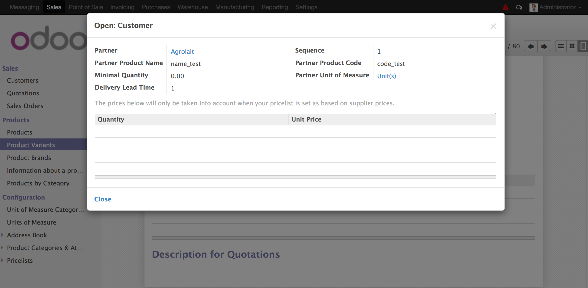

.. image:: https://img.shields.io/badge/licence-AGPL--3-blue.svg
================================================================
    :alt: License: AGPL-3
    :target: http://www.gnu.org/licenses/agpl-3.0.en.html

Product supplier info for customers - Sale
==========================================

This module extends of module *Product supplier info for customers* and allows
use the product codes and product name configured in each products in sale
orders.

Installation
------------

Installing the module sale and product_supplier_info_for_customer this module
will be installed.

Configuration
-------------

Usage
-----

-----

-----

-----

-----

-----

-----

=====

To use this module, you need:

- Go to product and configure *Partner product name* and *Partner product code*
  for each selected customer.

- When add order lines in sale quotation for a customer that has an specific
  name and code in the product, you can search that product with that customer
  name or code. Then, this values will be displayed in product description.

- If product does not have a configuration for customer selected, product will
  be search by its default code.

.. figure:: static/description/search_code_2.png
    :alt: Search by exist customer code
    :width: 600 px

.. figure:: static/description/description_code_2.png
    :alt: Search by exist customer code
    :width: 600 px

Known issues / Roadmap
----------------------

Bug Tracker
-----------

Credits
-------

### Contributors

* Moisés López <moylop260@vauxoo.com>
* Yennifer Santiago <yennifer@vauxoo.com>
* Julio Serna Hernández <julio@vauxoo.com>

### Funders
### Maintainer

.. image:: https://odoo-community.org/logo.png
   :alt: Odoo Community Association
      :target: https://odoo-community.org

This module is maintained by the OCA.

OCA, or the Odoo Community Association, is a nonprofit organization whose
mission is to support the collaborative development of Odoo features and
promote its widespread use.

To contribute to this module, please visit https://odoo-community.org.

[//]: # (copyright)

----

**Odoo** is a trademark of [Odoo S.A.](https://www.odoo.com/) (formerly OpenERP, formerly TinyERP)

**OCA**, or the [Odoo Community Association](http://odoo-community.org/), is a nonprofit organization whose
mission is to support the collaborative development of Odoo features and
promote its widespread use.

**zeroincombenze®** is a trademark of [SHS-AV s.r.l.](http://www.shs-av.com/)
which distributes and promotes **Odoo** ready-to-use on its own cloud infrastructure.
[Zeroincombenze® distribution](http://wiki.zeroincombenze.org/en/Odoo)
is mainly designed for Italian law and markeplace.
Everytime, every Odoo DB and customized code can be deployed on local server too.

[//]: # (end copyright)

[//]: # (addons)

[//]: # (end addons)

